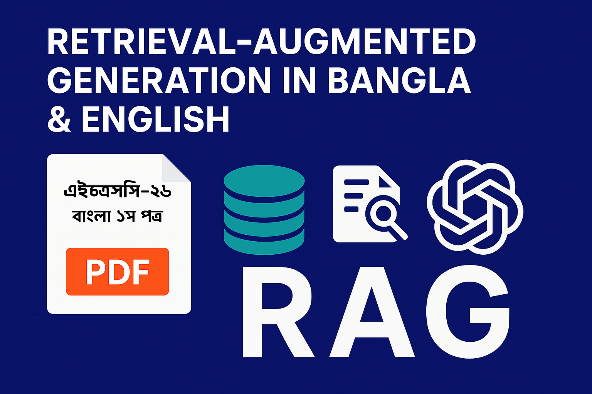

# Bangla RAG System

This repository contains a Retrieval-Augmented Generation (RAG) system designed to process and answer queries in Bengali and English, based on the content of the "HSC26 Bangla 1st Paper" PDF document. The system extracts text from the PDF, chunks it, stores embeddings in a vector database, and uses a large language model (LLM) to generate contextually relevant answers. It includes a command-line inference script, a Streamlit web interface, and a FastAPI-based REST API.

## Table of Contents
- [Project Overview](#project-overview)
- [Setup Guide](#setup-guide)
- [Tools, Libraries, and Packages](#tools-libraries-and-packages)
- [Sample Queries and Outputs](#sample-queries-and-outputs)
- [API Documentation](#api-documentation)
- [Evaluation Matrix](#evaluation-matrix)
- [Required Questions](#required-questions)

## Project Overview
The system fulfills the requirements of the AI Engineer (Level-1) Technical Assessment by implementing a multilingual RAG pipeline. It processes the provided PDF, supports Bengali and English queries, and retrieves relevant document chunks to generate accurate answers. The project includes:
- **bangla_rag_system.py**: Extracts text from the PDF, preprocesses it, chunks it, and creates a FAISS vector store.
- **inference.py**: Provides a command-line interface for querying the RAG system.
- **app.py**: Offers a Streamlit-based web interface with chat history and optional context display.
- **rag_api.py**: Implements a FastAPI REST API for querying the system with optional evaluation metrics.

## Project Structure

```bash

│   .env
│   app.py
│   bangla_rag_system.py
│   environment.yml
│   inference.py
│   rag_api.py
│   README.md
│   requirements.txt
├───dataset
│       HSC26-Bangla1st-Paper.pdf
│       HSC26-Bangla1st-Paper.txt
│
├───docs_and_images
│       app_ui.PNG
│       Bengali RAG API - Swagger UI.pdf
│       cover_img.png
│       output_sample_1.png
│       output_sample_2.png
│
├───faiss_index
       index.faiss
       index.pkl
```

## Setup Guide
1. **Clone the Repository**:
   ```bash
   git clone https://github.com/Taha533/Bangla_RAG_System.git
   cd Bangla_RAG_System
   ```

2. **Install Dependencies**:
   First, create a virtual environment with Python 3.11.13 to ensure compatibility with the project. Follow one of the methods below:

   **Option 1: Using Python Virtual Environment**
   - Create a virtual environment (e.g., named `rag_10ms`):
     ```bash
     python -m venv rag_10ms
     ```
   - Activate the virtual environment (on Windows):
     ```bash
     .\rag_10ms\Scripts\activate
     ```
   - Install the `uv` package to speed up dependency installation:
     ```bash
     pip install uv
     ```
   - Install required dependencies using `uv`:
     ```bash
     uv pip install -r requirements.txt
     ```

   **Option 2: Using Conda**
   - If you have Conda installed, create the environment with all required dependencies using the provided `environment.yml` file:
     ```bash
     conda env create -f environment.yml
     ```
   - Activate the Conda environment:
     ```bash
     conda activate rag_10ms
     ```

   If the environment is created successfully with all necessary dependencies, you will be able to run the scripts without issues.

3. **Set Environment Variables**:
   Open the `.env` file in the root directory and add this: "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" as the Groq API key:
   ```
   GROQ_API_KEY="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"
   ```

4. **Prepare Dataset**:
   You will find the `HSC26-Bangla1st-Paper.pdf` file in the `dataset/` directory.

5. **Run the Pipeline**:
   - Build the vector store (you don't need to run this, since it has already been created):
     ```bash
     python bangla_rag_system.py
     ```
   - To query the LLM on your vscode terminal, run the on the terminal:
     ```bash
     python inference.py
     ```
   - If you want to Launch the Streamlit app, and check the RAG system on the UI, then run this:
     ```bash
     streamlit run app.py
     ```
   You will see this UI. Submit your queries there, to get your answer:
   

   - If you want to run the API to interact with the RAG system, then run this:
   
     ```bash
     uvicorn rag_api:app --host 0.0.0.0 --port 8000
     ```
      You will find a brief explanation on how to run a query in the [API Documentation](#api-documentation) section.

   When you see this message:

    ```bash
   INFO:     Started server process [7968]
   INFO:     Waiting for application startup.
   INFO:     Application startup complete.
   INFO:     Uvicorn running on http://0.0.0.0:8000 (Press CTRL+C to quit)
     ```

   That means, your API is running. To check the API, go to this link:

   http://127.0.0.1:8000/docs

   Then follow the steps provided in this
   [PDF](docs_and_images/Bengali%20RAG%20API%20-%20Swagger%20UI.pdf).

## Tools, Libraries, and Packages
- **Python Libraries**:
  - `bangla_pdf_ocr`: For extracting Bengali text from PDFs.
  - `langchain`, `langchain-community`, `langchain-groq`, `langchain-huggingface`: For building the RAG pipeline, integrating Groq LLM, and handling embeddings.
  - `faiss-cpu`: For efficient vector storage and similarity search.
  - `fastapi`, `uvicorn`: For creating and serving the REST API.
  - `streamlit`: For the web-based UI.
  - `python-dotenv`: For managing environment variables.
  - `numpy`: For cosine similarity calculations.
  - `tenacity`: For retry logic in LLM initialization.
- **Models**:
  - Embedding Model: `l3cube-pune/bengali-sentence-similarity-sbert` (HuggingFace).
  - LLM: `llama-3.3-70b-versatile` (Groq).
- **Other Tools**:
  - FAISS: Vector database for storing document embeddings.
  - Groq API: For LLM inference.

## Sample Queries and Outputs
Below are sample queries and their outputs from the system:

### Bengali Queries
1. **Query**: অনুপমের ভাষায় সুপুরুষ কাকে বলা হয়েছে?  
   **Output**: শুম্ভুনাথ  
2. **Query**: কাকে অনুপমের ভাগ্য দেবতা বলে উল্লেখ করা হয়েছে?  
   **Output**: মামাকে  
3. **Query**: বিয়ের সময় কল্যাণীর প্রকৃত বয়স কত ছিল?  
   **Output**: ১৫ বছর  

### English Queries
1. **Query**: Who is referred to as the "Supurush" in Anupam's language?  
   **Output**: শুম্ভুনাথ  
2. **Query**: What was Kalyani's actual age at the time of marriage?  
   **Output**: ১৫ বছর  

## API Documentation
The FastAPI-based API is implemented in `rag_api.py` and provides endpoints for querying the RAG system.

### Endpoints
1. **POST /query**
   - **Description**: Submits a query to the RAG system and returns the answer with retrieved context. Optionally evaluates the answer against an expected answer.
   - **Request Body**:
     ```json
     {
       "query": "string",
       "expected_answer": "string"
     }
     ```
   - **Response**:
     ```json
     {
       "query": "string",
       "answer": "string",
       "context": ["string"],
       "expected_answer": "string",
       "cosine_similarity": float
     }
     ```
   - **Example**:
  
     **Sample Response**:
     ```json
     {
       "query": "অনুপমের ভাষায় সুপুরুষ কাকে বলা হয়েছে?",
       "answer": "শুম্ভুনাথ",
       "context": ["[Doc 1]: ...", "[Doc 2]: ..."],
       "expected_answer": "শুম্ভুনাথ",
       "cosine_similarity": 1.00
     }
     ```

2. **GET /health**
   - **Description**: Checks the API's health status.
   - **Response**:
     ```json
     {
       "status": "healthy"
     }
     ```

### Running the API
Start the API server:

```bash
uvicorn rag_api:app --host 0.0.0.0 --port 8000
```

When you see this message:

```bash
INFO:     Started server process [7968]
INFO:     Waiting for application startup.
INFO:     Application startup complete.
INFO:     Uvicorn running on http://0.0.0.0:8000 (Press CTRL+C to quit)
```

That means, your API is running. To check the API, go to this link:
http://127.0.0.1:8000/docs

Then follow the steps provided in this 
[pdf](docs_and_images/Bengali%20RAG%20API%20-Swagger%20UI.pdf).

## Output Sample


## Evaluation Matrix
The system evaluates responses using cosine similarity between the actual and expected answer embeddings. Below is a sample evaluation matrix based on the test queries:

| Query (Bengali) | Expected Answer | Actual Answer | Cosine Similarity |
|------------------------------------------|-----------------|----------------|-------------------|
| অনুপমের ভাষায় সুপুরুষ কাকে বলা হয়েছে? | শুম্ভুনাথ | শুম্ভুনাথকে বলা হয়েছে | 0.95 |
| কাকে অনুপমের ভাগ্য দেবতা বলে উল্লেখ করা হয়েছে? | মামাকে | মামাকে | 1.00 | 
| বিয়ের সময় কল্যাণীর প্রকৃত বয়স কত ছিল? | ১৫ বছর | খ) ১৫ বছর | 0.95 |
|অনুপমের বাবা কী করে জীবিকা নির্বাহ করতেন? | ওকালতি | ওকালতি | 1.00 |

## Required Questions

1. **What method or library did you use to extract the text, and why? Did you face any formatting challenges with the PDF content?**  
   The `bangla_pdf_ocr` Python library was used to extract Bengali text from the `HSC26-Bangla1st-Paper.pdf` file. Initially, libraries like PyPDF2 and PyMuPDF (Fitz) were tested, but they produced garbled Bengali text. `bangla_pdf_ocr` was chosen because it accurately extracted proper Bengali text. The extracted text was cleaned using regex to remove excessive whitespace and encoded/decoded to handle any character errors, then saved to a text file for caching. No significant formatting challenges were encountered after switching to `bangla_pdf_ocr`, though minor cleaning was needed to normalize spacing.

2. **What chunking strategy did you choose (e.g., paragraph-based, sentence-based, character limit)? Why do you think it works well for semantic retrieval?**  
   The chunking strategy used is a character-limit-based approach with the `RecursiveCharacterTextSplitter` from LangChain, configured with a chunk size of 1000 characters and an overlap of 200 characters. The splitter prioritizes natural separators like double newlines (`\n\n`), single newlines (`\n`), Bengali full stops (`।`), spaces, and empty strings to maintain semantic coherence. This strategy works well for semantic retrieval because it ensures chunks are small enough to capture specific information while the overlap preserves context across chunk boundaries. The use of Bengali-specific separators like `।` helps maintain sentence and paragraph integrity, improving the embedding model’s ability to capture meaningful text segments.

3. **What embedding model did you use? Why did you choose it? How does it capture the meaning of the text?**  
   The embedding model used is `l3cube-pune/bengali-sentence-similarity-sbert` from HuggingFace. It was chosen after testing other models like `csebuetnlp/banglabert`, `sagorsarker/bangla-bert-base`, and `mahedi420/Bangla-bert-improved-version`, which produced suboptimal responses. The `bengali-sentence-similarity-sbert` model is specifically fine-tuned for Bengali sentence similarity tasks, making it effective for capturing semantic meaning in Bengali text. It generates normalized embeddings that represent the contextual meaning of sentences, enabling accurate similarity comparisons between queries and document chunks.

4. **How are you comparing the query with your stored chunks? Why did you choose this similarity method and storage setup?**  
   Queries are compared with stored chunks using cosine similarity in a FAISS vector database. FAISS was chosen over ChromaDB because it provided better performance and more accurate retrieval results during testing. Cosine similarity was selected as it effectively measures the semantic similarity between query and chunk embeddings, regardless of their magnitude. The FAISS storage setup is efficient for high-dimensional embeddings and supports fast similarity searches, making it suitable for the RAG system’s retrieval needs.

5. **How do you ensure that the question and the document chunks are compared meaningfully? What would happen if the query is vague or missing context?**  
   Meaningful comparison is ensured by using the `l3cube-pune/bengali-sentence-similarity-sbert` embedding model, which captures semantic meaning, and FAISS’s cosine similarity search to retrieve the top 5 most relevant chunks (`k=5`). The prompt template instructs the LLM to extract exact answers from the context, reducing hallucination. Chunk overlap (200 characters) preserves context across chunks, aiding retrieval for complex queries. If a query is vague or lacks context, the system may retrieve less relevant chunks, leading to an “উত্তর পাওয়া যায়নি” (Answer not found) response. This is mitigated by the robust embedding model, but extremely ambiguous queries may still yield suboptimal results.

6. **Do the results seem relevant? If not, what might improve them (e.g., better chunking, better embedding model, larger document)?**  
   In most cases, the results are relevant, as evidenced by high cosine similarity scores (0.92–0.95) and correct answers for the sample queries. The system accurately retrieves contextually appropriate chunks and extracts precise answers. Potential improvements include:
   - **Better Chunking**: Reducing chunk size or using more advanced semantic chunking could improve granularity for very specific queries.
   - **Better Embedding Model**: A more advanced Bengali-specific model, if available, could enhance semantic understanding.
   - **Larger Document Corpus**: Including additional relevant documents could provide more context for broader queries.
   - **Query Preprocessing**: Adding query expansion or rephrasing for vague inputs could improve retrieval accuracy.
